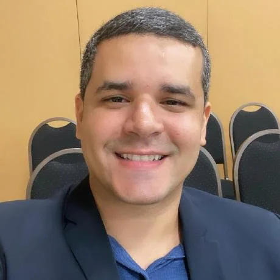
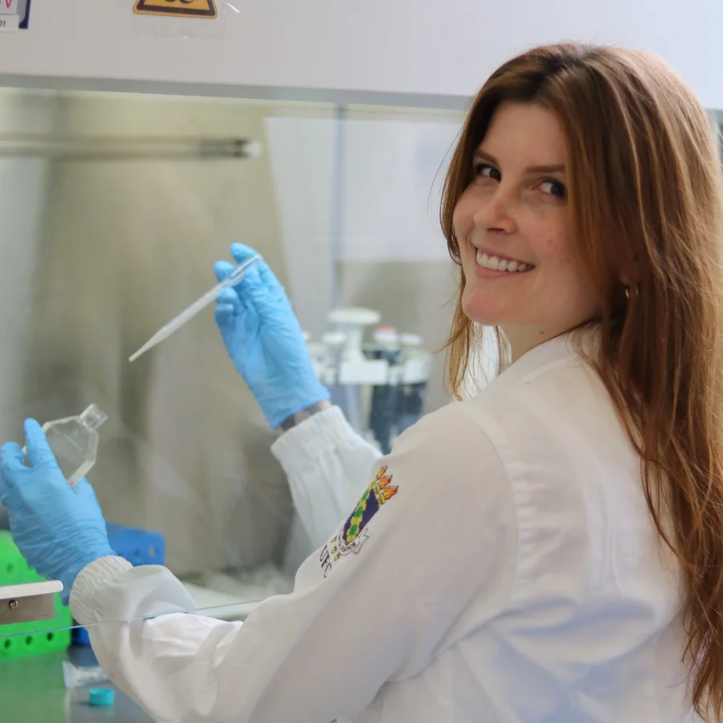
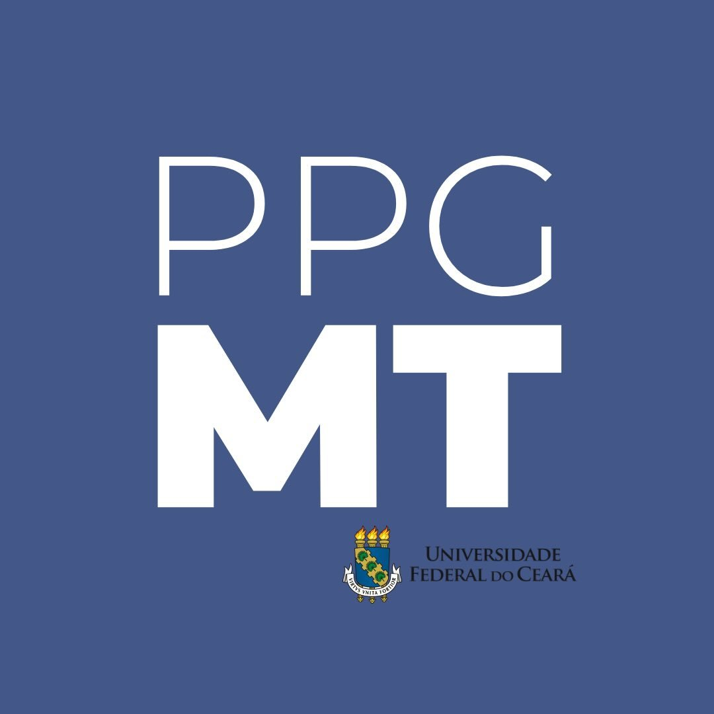
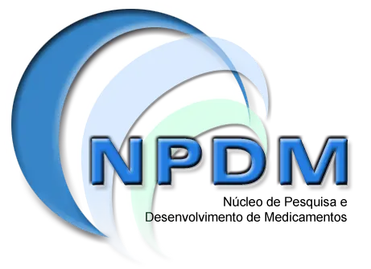
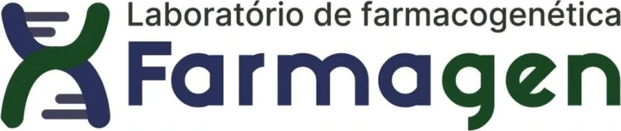
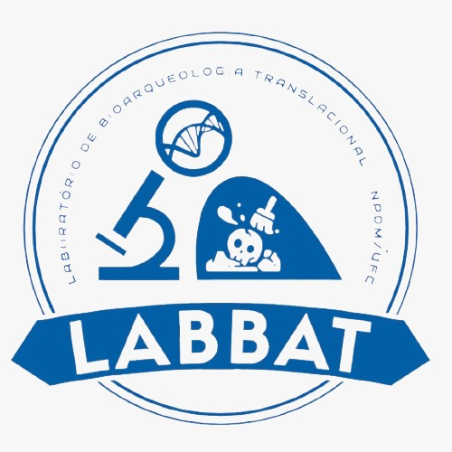
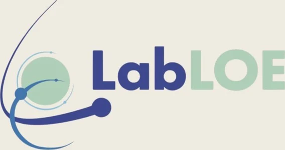

::: {.course-intro}
::: {.course-kicker}
Programa de Pós-Graduação em Medicina Translacional · Universidade Federal do Ceará
:::

Uma disciplina prática para conectar genética, programação em R, dados ômicos e implementação clínica.

::: {.course-meta}
24 de agosto a 21 de setembro de 2026
Segundas e quartas
8h às 12h
:::

::: {.course-actions}
[Ver cronograma](#cronograma){.btn .btn-primary} [Abrir tutoriais](tutoriais/index.qmd){.btn .btn-outline-primary}
:::
:::

## Objetivo

Capacitar os estudantes a compreender e aplicar conceitos, métodos e ferramentas de bioinformática na análise de dados genômicos, transcriptômicos e clínicos, utilizando a linguagem R, bancos de dados biomédicos e fluxos computacionais reprodutíveis para investigar doenças raras, câncer e outras aplicações da medicina de precisão, com interpretação crítica dos resultados e organização dos dados segundo os princípios FAIR.

## Professores

::: {.faculty-grid}
::: {.faculty-card}
{.faculty-photo fig-alt="Retrato de Allysson Allan de Farias"}

### Allysson Allan de Farias

Adicione aqui uma minibiografia, linhas de pesquisa ou área de atuação.

::: {.faculty-links}
[⌁ CV Lattes](https://lattes.cnpq.br/SEU_ID){.faculty-link}
[◎ Instagram do laboratório](https://instagram.com/SEU_LAB){.faculty-link}
:::
:::

::: {.faculty-card}
{.faculty-photo fig-alt="Retrato de Felipe Pantoja Mesquita"}

### Felipe Pantoja Mesquita

Adicione aqui uma minibiografia, linhas de pesquisa ou área de atuação.

::: {.faculty-links}
[⌁ CV Lattes](https://lattes.cnpq.br/SEU_ID){.faculty-link}
[◎ Instagram do laboratório](https://instagram.com/SEU_LAB){.faculty-link}
:::
:::

::: {.faculty-card}
{.faculty-photo fig-alt="Thalita Basso Scandolara em atividade no laboratório"}

### Thalita Basso Scandolara

Adicione aqui uma minibiografia, linhas de pesquisa ou área de atuação.

::: {.faculty-links}
[⌁ CV Lattes](https://lattes.cnpq.br/SEU_ID){.faculty-link}
[◎ Instagram do laboratório](https://instagram.com/SEU_LAB){.faculty-link}
:::
:::
:::

## Instituições e laboratórios

::: {.logo-grid}
::: {.logo-item}
{.logo-wide fig-alt="Universidade Federal do Ceará"}
:::
::: {.logo-item}
{.logo-square fig-alt="Programa de Pós-Graduação em Medicina Translacional da UFC"}
:::
::: {.logo-item}
{fig-alt="Núcleo de Pesquisa e Desenvolvimento de Medicamentos"}
:::
::: {.logo-item}
{.logo-wide fig-alt="Laboratório de Farmacogenética"}
:::
::: {.logo-item}
{.logo-square fig-alt="Laboratório de Bioarqueologia Translacional"}
:::
::: {.logo-item}
{.logo-wide fig-alt="Laboratório de Oncologia Experimental da UFC"}
:::
:::

## Cronograma {#cronograma}

::: {.schedule}
::: {.schedule-row .is-live}
::: {.schedule-date}
**24 AGO**  
Aula 01
:::
::: {.schedule-content}
### Conceitos básicos de genética

Organização do genoma humano, expressão gênica, mutação, recombinação, deriva genética, seleção, ancestralidade e consanguinidade.

Conteúdo liberado
:::
:::

::: {.schedule-row .is-next}
::: {.schedule-date}
**26 AGO**  
Aula 02
:::
::: {.schedule-content}
### Conceitos básicos de programação em R

Preparação para a próxima aula: instalar R, RStudio e o pacote `swirl`.

[Preparar computador →](tutoriais/instalacao_r_rstudio_swirl.qmd){.schedule-link}
Pré aula disponível
:::
:::

::: {.schedule-row}
::: {.schedule-date}
**31 AGO**  
Aula 03
:::
::: {.schedule-content}
### Bioinformática em R
Em breve
:::
:::

::: {.schedule-row}
::: {.schedule-date}
**02 SET**  
Aula 04
:::
::: {.schedule-content}
### Genômica e transcriptômica
Em breve
:::
:::

::: {.schedule-row}
::: {.schedule-date}
**09 SET**  
Aula 05
:::
::: {.schedule-content}
### Bancos de dados de ômicas e clínicos
Em breve
:::
:::

::: {.schedule-row}
::: {.schedule-date}
**14 SET**  
Aula 06
:::
::: {.schedule-content}
### Oncologia de precisão
Em breve
:::
:::

::: {.schedule-row}
::: {.schedule-date}
**16 SET**  
Aula 07
:::
::: {.schedule-content}
### Doenças raras
Em breve
:::
:::

::: {.schedule-row}
::: {.schedule-date}
**21 SET**  
Aula 08
:::
::: {.schedule-content}
### Medicina de precisão e implementação clínica
Em breve
:::
:::
:::

## Conteúdo liberado





<!--
As aulas abaixo ficam comentadas enquanto o conteúdo ainda não foi ministrado.
Para liberar uma aula manualmente, remova apenas os marcadores AULA_XX_START e AULA_XX_END.
Antes de publicar, troque COLE_AQUI_A_URL pelos links reais.
-->

<!-- AULA_03_START
::: {.lesson-card}
::: {.lesson-number}
03
:::
::: {.lesson-body}
### Bioinformática em R

**31 de agosto de 2026**

Bioconductor, manipulação de dados biomédicos e visualização.

::: {.resource-grid}
::: {.resource-box}
**Slides**  
[Slides da aula](COLE_AQUI_A_URL)
:::
::: {.resource-box}
**Exercícios**  
[Exercícios](COLE_AQUI_A_URL)
:::
::: {.resource-box}
**Apoio**  
[Material complementar](COLE_AQUI_A_URL)
:::
:::
:::
:::
AULA_03_END -->

<!-- AULA_04_START
::: {.lesson-card}
::: {.lesson-number}
04
:::
::: {.lesson-body}
### Genômica e transcriptômica

**2 de setembro de 2026**

NGS, fluxos reprodutíveis e análise de expressão gênica diferencial.

::: {.resource-grid}
::: {.resource-box}
**Slides**  
[Slides da aula](COLE_AQUI_A_URL)
:::
::: {.resource-box}
**Exercícios**  
[Exercícios](COLE_AQUI_A_URL)
:::
::: {.resource-box}
**Apoio**  
[Material complementar](COLE_AQUI_A_URL)
:::
:::
:::
:::
AULA_04_END -->

<!-- AULA_05_START
::: {.lesson-card}
::: {.lesson-number}
05
:::
::: {.lesson-body}
### Bancos de dados de ômicas e clínicos

**9 de setembro de 2026**

NCBI, GEO, SRA, GTEx, 1000 Genomes e gnomAD.

::: {.resource-grid}
::: {.resource-box}
**Slides**  
[Slides da aula](COLE_AQUI_A_URL)
:::
::: {.resource-box}
**Exercícios**  
[Exercícios](COLE_AQUI_A_URL)
:::
::: {.resource-box}
**Apoio**  
[Material complementar](COLE_AQUI_A_URL)
:::
:::
:::
:::
AULA_05_END -->

<!-- AULA_06_START
::: {.lesson-card}
::: {.lesson-number}
06
:::
::: {.lesson-body}
### Oncologia de precisão

**14 de setembro de 2026**

Painéis, variantes somáticas, bancos de conhecimento e contexto ambiental.

::: {.resource-grid}
::: {.resource-box}
**Slides**  
[Slides da aula](COLE_AQUI_A_URL)
:::
::: {.resource-box}
**Exercícios**  
[Exercícios](COLE_AQUI_A_URL)
:::
::: {.resource-box}
**Apoio**  
[Material complementar](COLE_AQUI_A_URL)
:::
:::
:::
:::
AULA_06_END -->

<!-- AULA_07_START
::: {.lesson-card}
::: {.lesson-number}
07
:::
::: {.lesson-body}
### Doenças raras

**16 de setembro de 2026**

Variantes germinativas, exoma, fenotipagem e classificação ACMG/AMP.

::: {.resource-grid}
::: {.resource-box}
**Slides**  
[Slides da aula](COLE_AQUI_A_URL)
:::
::: {.resource-box}
**Exercícios**  
[Exercícios](COLE_AQUI_A_URL)
:::
::: {.resource-box}
**Apoio**  
[Material complementar](COLE_AQUI_A_URL)
:::
:::
:::
:::
AULA_07_END -->

<!-- AULA_08_START
::: {.lesson-card}
::: {.lesson-number}
08
:::
::: {.lesson-body}
### Medicina de precisão e implementação clínica

**21 de setembro de 2026**

Genoma completo, multiômica, farmacogenômica, PRS, biópsia líquida, célula única e Perturb-seq.

::: {.resource-grid}
::: {.resource-box}
**Slides**  
[Slides da aula](COLE_AQUI_A_URL)
:::
::: {.resource-box}
**Exercícios**  
[Exercícios](COLE_AQUI_A_URL)
:::
::: {.resource-box}
**Apoio**  
[Material complementar](COLE_AQUI_A_URL)
:::
:::
:::
:::
AULA_08_END -->

## Avaliação

O trabalho final utilizará dados ômicos em uma análise estatística com teste de hipóteses e geração de gráficos no R. A organização, documentação e reutilização do trabalho serão avaliadas à luz dos princípios FAIR.

[Ver critérios e referências →](avaliacao.qmd){.text-link}
